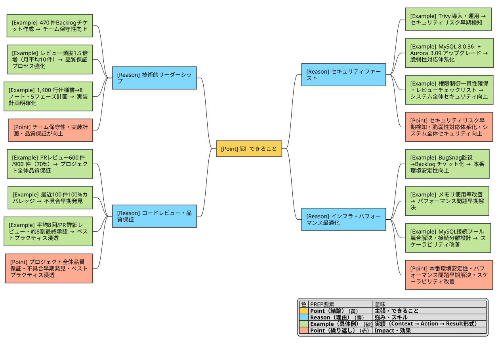
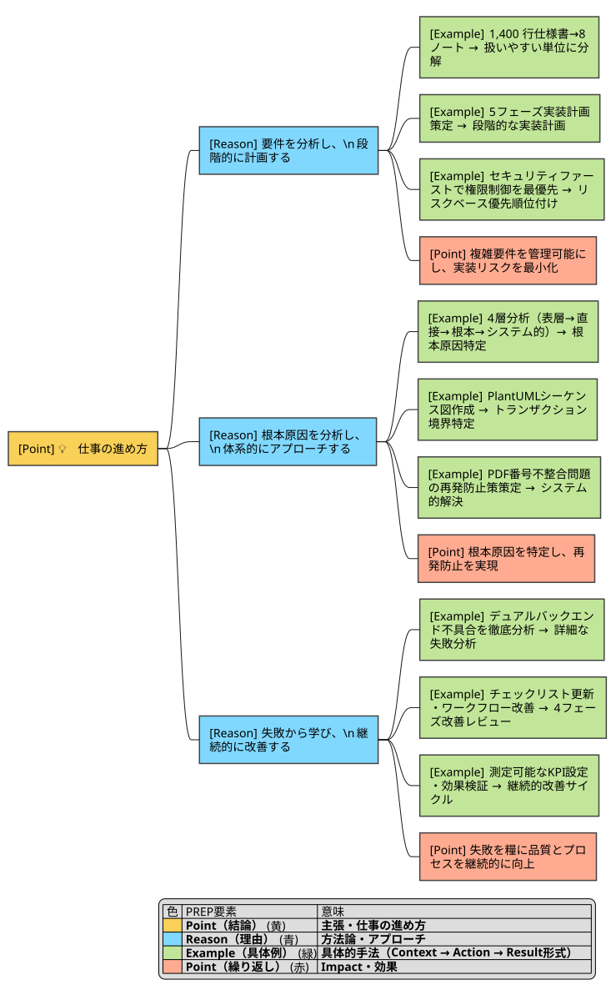

# 有賀 信行 - Engineering Profile

<!--
  UX原則: Visual Hierarchy - H1は最重要、大きく太く
  出典: Apple Human Interface Guidelines (Typography)
-->

> SE, ブリッジSE, PG | 4年の受託開発経験

<!--
  UX原則: Plain Language - リード文は簡潔に、主要ポイントで始める
  出典: Holistics Design System (Grammar & Mechanics), Google Developer Documentation Style Guide
-->

---

## 📊 概要

<!--
  UX原則: Progressive Disclosure - まず概要を提示し、段階的に詳細を開示
  出典: Apple Human Interface Guidelines (Layout - Visual Hierarchy)
  UX原則: Bullet List Constraints - 認知負荷を最小化（最大7項目、推奨5-7項目）
  出典: Miller's Law (1956), Cognitive Load Theory
-->

- *Core Strengths*: フルスタック開発、系統的な問題分析、インフラ・データベース最適化
- *Experience*: フルスタック開発（フロントエンド: React.js/Vue.js、バックエンド: Laravel/Golang）、コードレビュー（年間600件以上のPR）、オフショア協業（ブリッジSE）
- *Focus*: 知識管理とコード品質に関心があり、チームの一員として取り組んでいます

<!--
  UX原則: User Journey - 面接官の最初の疑問「この人は誰？」に30秒で答える
  出典: Coda Technical Writing Style Guide (Managing/placing help docs)
-->

詳細な経歴・プロジェクト経験は [JSON Resume](./resume-public.pdf) をご覧ください。

---

## 💪 できること

<!--
  UX原則: User-Centered Headings - ユーザー（面接官）の疑問に直接答える見出し
  出典: Google Developer Documentation Style Guide (Headings)
-->

### ドキュメントとレビュー活動

<!--
  UX原則: Visual Hierarchy - H3で具体的なトピックを明示
  UX原則: Typography - 見出しは名詞句（概念的なセクション）
  出典: Google Developer Documentation Style Guide (Headings), Apple Human Interface Guidelines (Typography)
  UX原則: Bullet List Constraints - ネスト最大3レベル、親レベル5項目以下推奨
  出典: Miller's Law (1956), Cognitive Load Theory
-->

- 高品質ドキュメント・タスク管理（約470件のBacklogチケット作成）
- レビュー頻度1.5倍増（月平均10件）に取り組みました
- 要件分析・構造化（1,400行仕様書→8ノート、5フェーズ計画）に携わりました

**結果として**: チーム全体の保守性向上、実装計画の明確化、品質保証プロセスの強化につながりました

<!--
  UX原則: Plain Language - 明確かつ簡潔に。専門用語を最小限に。
  UX原則: Visual Hierarchy - **太字**で重要ポイント（Impact）を強調
  出典: Holistics Design System (Plain Language), Apple Human Interface Guidelines (Typography - Conveying Hierarchy)
-->

### コードレビューへの取り組み

- 1年間で約600件/900件（約7割）のPRレビューに携わりました
- 最近100件は100%カバレッジを達成、約8割を最終承認
- 1PRあたり平均8回の詳細レビューで品質保証に取り組みました

**結果として**: プロジェクト全体の品質保証、不具合の早期発見、チームのベストプラクティス浸透につながりました

### セキュリティへの取り組み

- Trivy導入・運用でPackage脆弱性の継続的監視・対応に携わりました
- MySQL 8.0.36、Aurora MySQL 3.09へのアップグレード、DB設定強化を経験
- 権限制御の一貫性確保、レビューチェックリストによる多層防御に取り組みました

**結果として**: セキュリティリスクの早期検知、脆弱性対応の体系化、システム全体のセキュリティ向上につながりました

### インフラチーム等と連携したパフォーマンスの改善

- BugSnag監視による本番エラーのリアルタイム検知、Backlogチケット化に取り組みました
- メモリ使用率改善等のパフォーマンス最適化に携わりました
- MySQL接続プール競合問題の解決、接続分離設計を経験しました

**結果として**: 本番環境の安定性向上、パフォーマンス問題の早期解決、システム全体のスケーラビリティ改善につながりました

---

## 💡 仕事の進め方

<!--
  UX原則: Grouping - 関連トピックを論理的なセクションにグループ化
  UX原則: Alignment - 一貫した見出しスタイルで整列
  出典: Apple Human Interface Guidelines (Layout - Visual Hierarchy)
-->

### 要件を分析し、段階的に計画する

大規模な要件を扱いやすい単位に**分解する** → 段階的な実装計画を**策定する** → リスクベースで**優先順位を付ける**

<!--
  UX原則: Plain Language - 矢印（→）で流れを視覚化
  出典: Material Design 3 (Visual Hierarchy)
-->

### 根本原因を分析し、体系的にアプローチする

問題を4層（表層 → 直接 → 根本 → システム的）で**分析する** → 原因を**可視化する**（PlantUMLシーケンス図） → 再発防止策を**策定する**

- PDF番号不整合問題では、シーケンス図で原因を可視化し、トランザクション境界の問題を特定しました

<!--
  UX原則: White Space - 箇条書き（•）で視覚的な休息と区別を提供
  出典: Apple Human Interface Guidelines (Layout - Visual Hierarchy)
-->

### 失敗から学び、継続的に改善する

自身の失敗を**詳細分析する** → チェックリスト・ワークフローを**改善する** → 測定可能なKPIで効果を**確認する**

- デュアルバックエンド不具合の失敗を徹底分析し、4フェーズの改善レビューワークフローを作成しました

### 自分がボトルネックにならないよう意識する根性

自分のタスクが滞らないよう**早めに動く** → 期日を守れない場合は**事前に相談する** → チームの進行を**妨げない**

- その日のうちに自分でボールを持ち続けないよう意識しています
- チケットの期日を守るよう心がけ、難しい場合は早めに上長に相談します
- 自分が案件遅延の原因にならないよう、必要に応じて残業も厭わず対応できる体力があります

---

## 💪 主要スキル

- *フルスタック開発*: React.js/Vue.js/Nuxt.js、Laravel/Golang
  - Vue 3 Composition API + TypeScriptを学習しました
- *インフラ・データベース*: Docker、AWS（ECS/S3/SQS/RDS）
  - MySQL接続プール競合問題の分析・解決を経験しました
- *問題分析・要件分析*: 4層根本原因分析、要件構造化
  - 1,400行仕様書→8個ノートで複雑要件を整理しました
- *セキュリティ・監視*: Trivy/BugSnag/Laravel Telescope活用
  - 継続的なセキュリティ・パフォーマンス監視、脆弱性対応に取り組みました
- *開発ツール・プロセス*: Git/Backlog/Slack活用
  - 約470件のBacklogチケット作成に携わりました

---

## 💼 経歴

- 約4年間の受託開発経験（2021年4月〜）。フルスタック開発者として、フロントエンド（React.js、Vue.js、Nuxt.js）、バックエンド（Laravel、Golang）で6つのプロジェクトを担当
- 2024年以降は大規模SaaSプロジェクトでコードレビュー・DevOps・セキュリティ改善を担当。オフショア開発チームとの協業経験有り（ブリッジSE、要件定義の約8割のチケットを作成）

---

## 👥 協働スタイル

- オフショアチーム（ベトナム）と15ヶ月協働、要件定義8割作成（53件中41件）
- PlantUML図解・コード例で技術的複雑性を可視化し説明改善
  - 手戻りが発生の無いように，できる限り少ない手数で，伝える，相談する相手と認識を揃えた上で，結論や合意に到達できるようなコミュニケーションを心がけます

---

<!-- ## 🌱 成長への取り組み -->

<!--
  UX原則: User Journey - 面接官の疑問「どんな課題に取り組んでいるか？」に答える
  出典: Coda Technical Writing Style Guide (User's Journey)
-->

### 現在の取り組み

<!-- - 失敗を詳細分析し、再発防止策を体系化しています
  - デュアルバックエンド不具合からアーキテクチャ理解チェックリストを作成
- LLM活用で知識管理を自動化・体系化に挑戦しています
  - 週次レビューエージェントを構築中、レビュー時間90%削減を目標（30-60分→5分）
- 認知バイアス対策として構造化質問フレームワーク（5W1H）を試しています
  - OKR目標管理で価値観を明確化し、選択と集中に取り組んでいます -->

### 今後の計画

### 前向きな視点

<!--
  UX原則: Honesty & Transparency - 弱みを正直に提示し、改善計画と前向きな側面を示す
  出典: Diátaxis (Explanation - Understanding-oriented)
-->

---

## 🔗 関連リンク

<!--
  UX原則: Progressive Disclosure - 詳細情報へのリンクを提供
  出典: Apple Human Interface Guidelines (Layout - Progressive Disclosure)
-->

- [JSON Resume](./resume-public.pdf) - 詳細な経歴・プロジェクト経験
- [Wantedly Profile](https://www.wantedly.com/id/ariga914) - プロフィール

<!-- TODO: GitHubのusernameが分かったらリンクを追加 -->

---

<!--
  ========================================
  UX原則サマリー（このコメントブロックは最終版では削除）
  ========================================

  適用したUX原則:

  1. Progressive Disclosure (段階的開示)
     - 出典: Apple Human Interface Guidelines (Layout)
     - 適用: At a Glance → 詳細セクションの流れ

  2. Visual Hierarchy (視覚的階層)
     - 出典: Apple Human Interface Guidelines (Typography, Layout)
     - 適用: H1 > H2 > H3の明確な階層、太字での強調

  3. Plain Language (平易な言語)
     - 出典: Holistics Design System (Grammar & Mechanics)
     - 適用: 専門用語最小化、簡潔な文章、主要ポイントで文を開始

  4. User Journey (ユーザーの旅程)
     - 出典: Coda Technical Writing Style Guide
     - 適用: 面接官の関心の流れに沿った構成（概要 → 強み → 働き方 → 協働 → 成長）

  5. Alignment (整列)
     - 出典: Apple Human Interface Guidelines (Layout)
     - 適用: 一貫した見出しスタイル、構造の整列

  6. White Space & Grouping (余白とグループ化)
     - 出典: Apple Human Interface Guidelines (Layout)
     - 適用: セクション間の区切り、関連トピックのグループ化

  7. Typography Hierarchy (タイポグラフィ階層)
     - 出典: Material Design 3, Google Developer Documentation Style Guide
     - 適用: 見出しレベルの一貫性、名詞句による概念的セクション見出し

  8. Information Architecture (情報アーキテクチャ)
     - 出典: Diátaxis Framework
     - 適用: Reference（事実・データ）とExplanation（理解・文脈）の分類

  ========================================
-->
